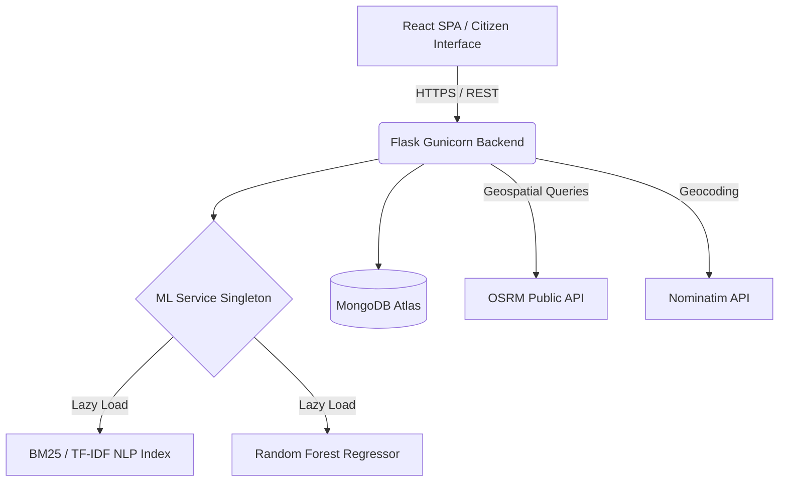
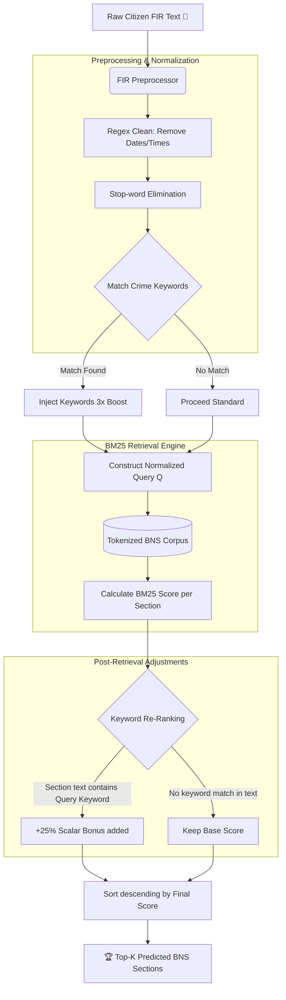

<div align="center">

# 🛡️ Sahayta — AI-Powered FIR & Crime Intelligence System

**A full-stack, research-driven AI platform automating First Information Report (FIR) filing, semantic legal section (BNS) prediction, and geospatial crime intelligence for law enforcement.**

[](https://myst-blazeio.github.io/Sahayta/)
[](https://python.org)
[](https://react.dev)
[](https://flask.palletsprojects.com)
[](https://mongodb.com)

</div>

### 🌐 Live Links

- **Frontend (Citizen & Police Portal):** [https://myst-blazeio.github.io/Sahayta/](https://myst-blazeio.github.io/Sahayta/)
- **Backend API:** [https://final-year-project-xabd.onrender.com](https://final-year-project-xabd.onrender.com) _(Note: Hosted on a free tier, it may take 30–60s to wake up on the first request.)_

---

## 📑 Abstract

**Sahayta** (Bengali: সহায়তা — _assistance_) is a comprehensive, intelligent law enforcement platform designed to digitise and automate the processing of First Information Reports (FIRs). It supersedes traditional paper-based systems by introducing predictive crime analytics, real-time safe-route navigation, and automated legal mapping.

The system's core innovation lies in its multi-tiered Natural Language Processing (NLP) architecture, which maps unconstrained natural language complaints from citizens directly to specific Indian legal statutes (Bharatiya Nyaya Sanhita - BNS sections). Furthermore, the platform integrates a geospatial routing engine with a historical crime incidence model to compute dynamic, risk-aware navigation paths for citizens, optimizing for physical safety based on geographic crime densities.

---

## 📋 Table of Contents

- [Abstract](#abstract)
- [System Architecture](#system-architecture)
- [Mathematical Models & Algorithms](#mathematical-models--algorithms)
  - [1. BNS Section Prediction (NLP & IRS)](#1-bns-section-prediction-nlp--irs)
  - [2. Geospatial Safe Routing Engine](#2-geospatial-safe-routing-engine)
  - [3. Spatiotemporal Crime Prediction](#3-spatiotemporal-crime-prediction)
- [Memory & Performance Optimizations](#memory--performance-optimizations)
- [API Reference](#api-reference)
- [Getting Started & Installation](#getting-started--installation)
- [License](#license)

---

## 🏗️ System Architecture

The project is structured as a decentralized, API-first architecture, separating the client-side presentation layer from the heavy computational and machine learning microservices.



### Full-Stack Implementation

- **Frontend Layer**: Built using React 18, TypeScript, and Vite. Implements JWT-authenticated sessions, Leaflet maps with heatmaps (`leaflet.heat`), dynamic Recharts analytics, and Framer Motion for UI fluidity.
- **Backend & Inference Layer**: Developed in Flask 3. Runs a memory-optimized ML Singleton that handles on-demand inference. Models are loaded directly into the Gunicorn master process and shared across workers using Copy-on-Write (COW) semantics.
- **Persistence Layer**: MongoDB Atlas, managing relational integrity through document references across `users`, `firs`, and `alerts` collections.

---

## 🧠 Mathematical Models & Algorithms

Sahayta utilizes a hybrid ensemble of heuristic, statistical, and machine learning techniques tailored for a resource-constrained production environment (maximum 512 MB RAM allocation).

### 1. BNS Section Prediction (NLP & IRS)

The text-to-law mapping algorithm acts as a specialized Information Retrieval System (IRS). It operates entirely within a bounded RAM footprint without reliance on massive dense transformer models natively.



#### A. FIR Preprocessing & Keyword Injection

Unstructured FIR input text $T$ undergoes:

1. Regex sanitization (stripping temporal data, dates, and domain-specific boilerplate like _"To the station house officer"_).
2. Stop-word elimination using a curated, domain-specific `_EN_STOPWORDS` set.
3. Crime Keyword Extraction: Intersecting the $T$ with a manually curated multi-dimensional set of 84 crime definitions $K$.

If $K_{detected} = K \cap T \neq \emptyset$, the system injects $3 \times K_{detected}$ at the head of the token sequence to heavily bias the subsequent retrieval probability density towards the core offense.

#### B. BM25 (Okapi) Retrieval

The core retrieval mechanism uses the BM25 ranking function, known for handling document length normalization superior to standard TF-IDF.
Given query $Q$ containing keywords $q_1, q_2, \dots, q_n$, the score for BNS Document $D$ is:

$$
\text{Score}_{BM25}(D, Q) = \sum_{i=1}^{n} \text{IDF}(q_i) \cdot \frac{f(q_i, D) \cdot (k_1 + 1)}{f(q_i, D) + k_1 \cdot \left(1 - b + b \cdot \frac{|D|}{\text{avgdl}}\right)}
$$

_Where:_

- $f(q_i, D)$ is the term frequency of $q_i$ in Document $D$.
- $|D|$ is the length of the document in words.
- $\text{avgdl}$ is the average document length in the corpus.
- Constants $k_1 = 1.5$ and $b = 0.75$.

#### C. Linear Keyword Bonus Re-ranking

To overcome vocabulary mismatch and short-document saturation, a post-retrieval scalar bonus is applied. For each document $D$ in the candidate response set:

$$
\text{Score}_{final} = \text{Score}_{BM25} + \left( \max(\text{Score}_{BM25}) \cdot \beta \cdot |K_{\text{hit}}| \right)
$$

_Where:_ $\beta = 0.25$ (empirically tuned) and $K_{\text{hit}}$ is the intersection of query crime keywords and the specific BNS section text.

_Fallback mechanism:_ Standard Vector-Space Model (VSM) using TF-IDF and Cosine Similarity ($cos(\theta) = \frac{A \cdot B}{||A|| ||B||}$) activates if the BM25 payload fails memory allocation.

---

### 2. Geospatial Safe Routing Engine

The routing engine calculates safe paths for pedestrians by evaluating historical crime topography.

#### A. Trajectory Risk Estimation

Let the geographic route trajectory $R$ returned by OSRM be a sequence of interconnected coordinate nodes: $R = [p_1, p_2, \dots, p_m]$ where $p_i = (\text{lat}_i, \text{lng}_i)$.
Historical crime clusters are modeled as points $C = [c_1, c_2, \dots, c_k]$.

For a sampled subset of route nodes $R' \subset R$ (stride optimized to $N/60$ points), the engine queries the Euclidean distance against crime clusters. An interaction mask is generated using a squared tolerance radius of $r^2 = 6.4 \times 10^{-5}$ (approx $800 \text{ meters}$ in projection space).

$$
\text{Distance}^2(p_i, c_j) = (\text{lat}_{c_j} - \text{lat}_{p_i})^2 + (\text{lng}_{c_j} - \text{lng}_{p_i})^2
$$

Mean Risk ($\mu_{risk}$) is computed over the exposed trajectory:

$$
\mu_{risk} = \frac{1}{|R'|} \sum_{p \in R'} \text{LocalRisk}(p)
$$

#### B. Realistic Distance-Based ETA Calculation

A strict, physics-based kinematic formula is enforced to ensure pedestrian ETA accuracy. OSRM engine durations (designed for vehicular throughput) are overridden.
ETA ($T$) is derived directly from geographic route length ($D$) assuming standard human walking velocity ($v \approx 1.38 \text{ m/s}$ or $5.0 \text{ km/h}$).

$$
T_{walk} = \frac{D}{1.38} + \mathcal{P}(\mu_{risk})
$$

Where $\mathcal{P}$ is a non-linear temporal penalty applied to "safe routes" representing the delay incurred by systematically routing around high-density threat perimeters.

---

### 3. Spatiotemporal Crime Prediction

A predictive analytics module estimates the expected volume of specific complaints geographically.

- **Model:** Random Forest Regressor (Scikit-Learn).
- **Input Vector ($X$):** $[\text{Ward}_{\text{encoded}}, \text{Year}, \text{Month}]$.
- **Target ($Y$):** Total aggregated crime incidence.

The ensemble operates by constructing a multitude of decision trees at training time and outputting the mean prediction of the individual trees, providing high variance resistance and minimizing Out-of-Bag (OOB) error.

---

## ⚡ Memory & Performance Optimizations

The software architecture complies with strict Low-Memory footprint paradigms:

1. **Model Lazy-Loading:** The `MLService` singleton defers memory allocation for `.pkl` models until the exact API route requires inference.
2. **Explicit Garbage Collection:** The `gc.collect()` interface is invoked manually inside routing iteration blocks to flush intermediate NumPy arrays and OSRM JSON payloads, bypassing standard cyclic reference delays.
3. **Graph Deprecation:** Removed heavily memory-bound `osmnx` and `networkx` graph topology mapping. Replaced entirety of pathfinding logic with OSRM HTTP offloading.

---

## 📡 API Reference

_Authentication: Bearer JWT is required for all endpoints except those marked `Public`._

### Core Endpoints

| Method   | Endpoint                        | Access        | Purpose                                                        |
| -------- | ------------------------------- | ------------- | -------------------------------------------------------------- |
| **POST** | `/api/auth/login`               | Public        | Obtains JWT access token.                                      |
| **POST** | `/api/fir/file`                 | Authenticated | Submits unstructured FIR, triggers BNS AI.                     |
| **POST** | `/api/intelligence/predict_bns` | Authenticated | Exposes raw access to BM25 Natural Language engine.            |
| **GET**  | `/api/safe-route/`              | Public        | Returns GeoJSON FeatureCollection with Risk Stats & Routing.   |
| **GET**  | `/api/police/analytics`         | Auth (Police) | Retrieves temporal and categorical aggregations for dashboard. |

---

## 🚀 Getting Started & Installation

### Local Development Setup

Ensure you have **Python 3.10+** and **Node.js 18+** installed along with access to a MongoDB cluster.

**1. Clone and Boot Backend**

```bash
git clone https://github.com/Myst-Blazeio/Sahayta.git
cd Sahayta/backend

# Initialize Virtual Env
python -m venv venv
source venv/bin/activate  # On Windows: venv\Scripts\activate

# Install Core ML & API Dependencies
pip install -r requirements.txt

# Hydrate the NLP Text Corpus (Builds index binaries)
python scripts/build_bns_index.py

# Launch WSGI / Flask Dev Server
python app.py
```

**2. Boot Frontend Interface**

```bash
cd ../frontend

npm install
npm run dev
```

The system will boot mapping `localhost:5000` to the inference engine and `localhost:5173` to the citizen interface.

---

## 📜 License

This system is developed as an academic and research initiative. All intellectual rights and distribution permissions remain with the foundational authors.
_(No commercial distribution without explicit consent)._

<div align="center">
  <sub>Built for precision, intelligence, and civilian assistance.</sub>
</div>
